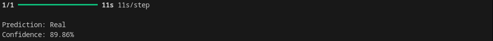

# CIFAKE – AI Generated Image Detection

## Overview

CIFAKE is a deep learning-based web application that detects whether an uploaded image is Real or AI-Generated using a Convolutional Neural Network (CNN). The application is built with TensorFlow, Keras, and Streamlit, providing users with an intuitive interface for image classification.

## Live Demo

🔗 https://cifake-ai-image-detection.onrender.com

## Features

- Detects whether an image is **Real** or **AI-Generated**
- CNN-based binary image classification
- Interactive Streamlit web interface
- Displays prediction confidence
- Supports JPG, JPEG and PNG images

## Technologies Used

- Python
- TensorFlow
- Keras
- Streamlit
- NumPy
- Pillow

## Project Structure

```text
CIFAKE/
│── app.py
│── predict.py
│── gradcam.py
│── requirements.txt
│── README.md
│
├── test_images/
│
├── home.png
├── prediction.png
└── gradcam.png
```

## Installation

```bash
pip install -r requirements.txt
```

## Run the Application

### Command Line

```bash
python predict.py
```

### Streamlit Web App

```bash
streamlit run app.py
```

## Sample Output

Prediction: Real

Confidence: 89.86%




## Future Improvements

- Grad-CAM heatmap visualization in the web interface
- Support for multiple AI image generators
- Improve CNN accuracy with advanced architectures
- Multi-class classification for different AI models
